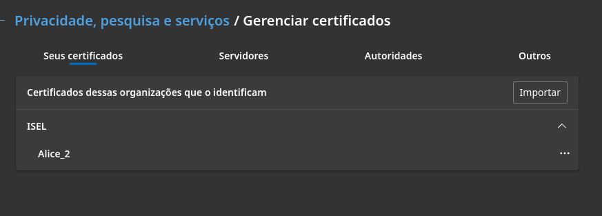

# 6
Comands used to transfom the keys:
```terminal
$ openssl x509 -inform de -in secure-server.cer -out secure-server-cer.pem
```
```terminal
$ openssl pkcs12 -in secure-server.pfx -out secure-server-pfx.pem --openssl-legacy-provider -nodes -legacy
```
> the CA2.cer from the trust-anchors need to be transformed to ```.pem``` too
```terminal
$ openssl x509 -inform des -in CA2.cer -out CA2.pem
```

To run the server:
```terminal
$ node https-server-base.js
```

In the browser is necessary to add the root certificate
Open browser ```settings```


Then in ```manage certificates``` -> ```Autorities``` do ```Import```


At last, thrust the certificate to identifie sites


In the browser the result is:


And the certificate analysis:


To add Alice certificate, same procedure but using the ```My certificates``` tab




The server will ask to select the certificate to use:


And open the web page:


In the mode console, it prints:
```terminal
Server started at port 4433
::1 Alice_2 GET /
```


## Javascript Code
```javascript
// Built-in HTTPS support
const https = require("https");
// Handling GET request (npm install express)
const express = require("express");
// Load of files from the local file system
var fs = require('fs'); 

const PORT = 4433;
const app = express();

// Get request for resource /
app.get("/", function (req, res) {
    console.log(
        req.socket.remoteAddress
        + ' ' + req.socket.getPeerCertificate().subject.CN
        + ' ' + req.method
        + ' ' + req.url);
    res.send("<html><body>Secure Hello World with node.js</body></html>");
});


// configure TLS handshake
const options = {
    key: fs.readFileSync('keys/secure-server-key-17nov.pem'),
    cert: fs.readFileSync('keys/secure-server-17nov.pem'),
    ca: fs.readFileSync('keys/certificates-keys/trust-anchors/CA2.pem'),
    requestCert: true, 
    rejectUnauthorized: true
};

// Create HTTPS server
https.createServer(options, app).listen(PORT, 
    function (req, res) {
        console.log("Server started at port " + PORT);
        console.log("Access it here: https://localhost:4433")
    }
);

```
